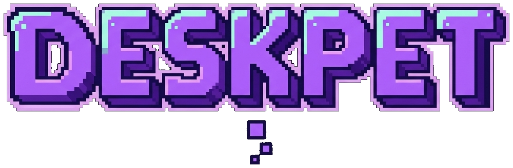
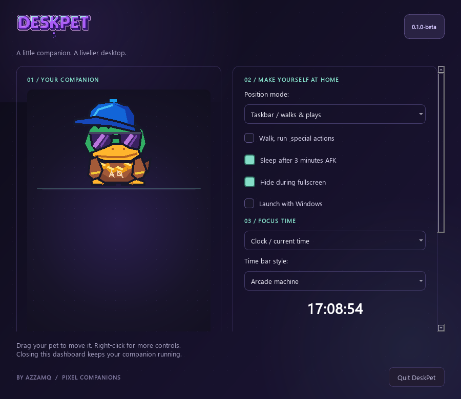
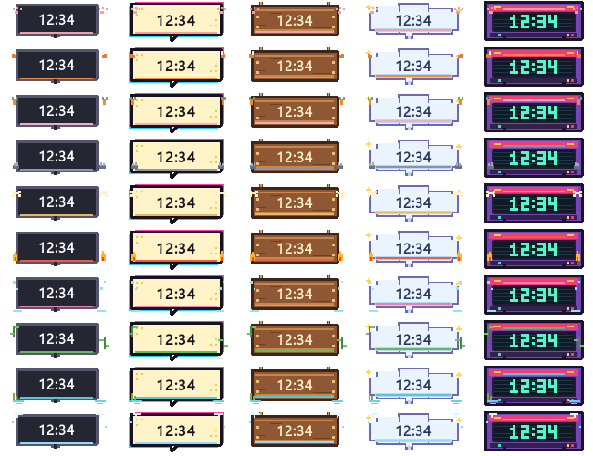
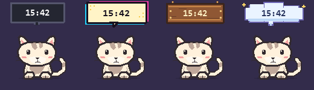
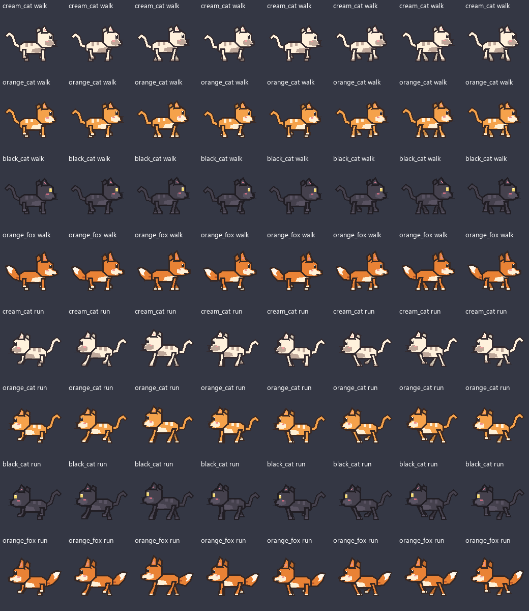

<div align="center">



### ✨ Your Pixel Desktop Companion for Windows ✨

[-blue.svg?style=for-the-badge&logo=windows)](https://github.com/Akuazzamq/DeskPet/releases)
[](LICENSE)
[](https://github.com/Akuazzamq/DeskPet/releases/latest)
[](https://github.com/Akuazzamq)

*A lively, adorable pixel-art companion that lives on your Windows desktop or walks along your taskbar.*  
*Featuring 10 distinct species, 21 skins, Pomodoro productivity timers, and responsive desktop antics!*

---



</div>

## 🚀 Quick Install (Windows 10 / 11)

You do **not** need Python installed. Choose either of the two easy methods below:

### Option 1: One-Line PowerShell Command (Recommended)
Open **PowerShell** and run:

```powershell
$installer = Join-Path $env:TEMP 'DeskPet-install.ps1'
Invoke-WebRequest https://raw.githubusercontent.com/Akuazzamq/DeskPet/main/install.ps1 -OutFile $installer
& $installer
```

*(This automatically downloads the latest verified release, validates the SHA-256 hash, creates Desktop & Start Menu shortcuts, and launches DeskPet!)*

---

### Option 2: Setup Wizard (EXE)
1. Go to the [**Releases Page**](https://github.com/Akuazzamq/DeskPet/releases/latest).
2. Download **`DeskPet-Setup.exe`**.
3. Run the installer and launch DeskPet directly from your Desktop shortcut or Start Menu!

> **Portable Version:** Prefer not to install? Download `DeskPet-Windows.zip`, extract it anywhere, and double-click `DeskPet.exe`.

---

## ✨ Features & Highlights

### 🐾 10 Unique Species & 21 Skins
Choose your favorite pixel companion! Each species has custom expressions, idle breathing, and unique soundless animations:
* 🐱 **Cat**: Cream, Orange, Black *(Grooming & Yarn Play)*
* 🦊 **Fox**: Autumn Orange *(Curious Leaf Pouncing)*
* 🐰 **Rabbit**: Snow, Caramel, Panda *(Carrot Nibbles & Hops)*
* 🦍 **Gorilla**: Black, White *(Chest Drumming & Knuckle-Walking)*
* 🐶 **Dog**: Doge, Shiba Inu with Jacket *(Bouncing Ball Play)*
* 🐲 **Dragon**: Emerald Winged, Red Lunar *(Hovering & Flame Breath)*
* 🦎 **Axolotl**: Pink, Golden *(Bubble Floating Trail)*
* 🐼 **Panda**: Classic, Brown *(Bamboo Snack)*
* 🦆 **Duck**: Normal, AzzamQ Mascot *(Puddle Splashing)*
* 🐧 **Penguin**: Classic, Blue *(Ice Waddling & Belly Slides)*

<div align="center">

</div>

---

### ⏰ Productivity Time Tools (Clock, Timer & Stopwatch)
Stay focused with your pet! DeskPet includes a Pomodoro timer and stopwatch styled to match your aesthetic:
* **5 Distinct Visual Themes**:
  * 👾 **Classic Pixel**: Clean retro aesthetic
  * 💬 **Comic Pop**: Vibrant halftone speech bubble
  * 🪵 **Cozy Wood**: Hanging wooden signpost
  * ☁️ **Cloud Dream**: Soft midnight starry clouds
  * 🕹️ **Arcade Cabinet**: Hand-drawn glowing pixel font
* **Habitat Trims**: Each animal decorates the time bar with custom pixel art (paws, autumn leaves, bamboo, flames, carrots, or snowflakes).

<div align="center">

</div>

---

### 🏃 Locomotion Modes & Desktop Antics
* **Desktop Mode**: Places your pet anywhere on your screen. Drag & drop anywhere!
* **Taskbar Mode**: Your pet wanders along the top of your Windows taskbar, hops around, runs, and occasionally attempts to climb the side of your screen.
* **AFK Detection**: After 3 minutes of inactivity, your pet curls up for a nap with gentle breathing and rising $Z$ particles.
* **Auto-Hide on Fullscreen**: Automatically stays hidden during fullscreen games or movies and returns when you're back on the desktop.

<div align="center">

</div>

---

## 🎮 Controls & Shortcuts

| Action | Control |
| :--- | :--- |
| **Pet Companion** | Move mouse cursor back and forth across the head |
| **Pick Up / Move** | Click and drag the pet anywhere on screen |
| **Poke / Wake Up** | Left-click pet |
| **Open Menu** | Right-click the pet or System Tray icon |
| **Dashboard** | Right-click > **Open Dashboard** (or launch shortcut again) |
| **Quit** | Dashboard > **Quit DeskPet** (or Right-Click > Quit) |

---

## 🔒 Safety & Verification

All release packages are strictly verified with SHA-256 checksums to ensure file integrity.

```powershell
# Verify package integrity locally
Get-FileHash .\dist\DeskPet-Setup.exe -Algorithm SHA256
```

Official SHA-256 checksums are published in the [Releases](https://github.com/Akuazzamq/DeskPet/releases) tab with every update.

---

## 📜 License & Terms

DeskPet is distributed as **Freeware** for personal, non-commercial use.  
All original artwork, animations, and compiled software are copyright © 2026 **AzzamQ**.

See the full [End User License Agreement (LICENSE)](LICENSE) for details.

---

<div align="center">
Made with ❤️ by <b>AzzamQ</b> · Pixel Companions
</div>
